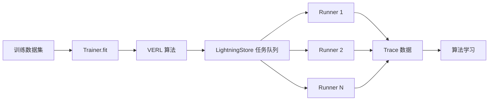
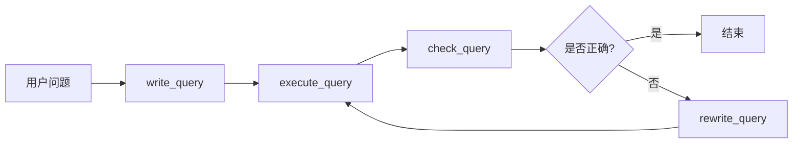

# Agent-Lightning 训练与 GRPO 算法深度解析

本文档详细介绍 Agent-Lightning 项目在训练集、Agent 训练、以及 GRPO 强化学习算法方面的设计和实现，特别关注 SQL 类型任务和开放式答案场景的处理方法。

## 目录

1. [概述](#概述)
2. [训练集管理](#训练集管理)
3. [Agent 训练架构](#agent-训练架构)
4. [强化学习应用](#强化学习应用)
5. [GRPO 算法详解](#grpo-算法详解)
6. [奖励函数设计](#奖励函数设计)
7. [SQL 任务训练实践](#sql-任务训练实践)
8. [开放式答案场景处理](#开放式答案场景处理)
9. [训练亮点总结](#训练亮点总结)

---

## 概述

Agent-Lightning 是一个灵活的 AI Agent 训练框架，其核心特点是：

- **零代码变更**：几乎不需要修改现有 Agent 代码即可进行训练
- **框架无关**：支持 LangChain、AutoGen、CrewAI、LangGraph 等多种 Agent 框架
- **算法多样**：支持强化学习（RL）、自动提示优化（APO）、监督微调（SFT）等多种算法
- **选择性优化**：可以在多 Agent 系统中选择性地优化特定 Agent

---

## 训练集管理

### 数据集格式

Agent-Lightning 支持多种数据集格式，主要包括：

1. **Parquet 格式**：推荐用于大规模训练
   ```python
   import pandas as pd
   
   # 读取训练数据
   train_data = pd.read_parquet("data/train.parquet").to_dict(orient="records")
   val_data = pd.read_parquet("data/val.parquet").to_dict(orient="records")
   ```

2. **字典列表格式**：每个样本是一个字典
   ```python
   train_dataset = [
       {"question": "问题1", "context": "上下文1", "answer": "答案1"},
       {"question": "问题2", "context": "上下文2", "answer": "答案2"},
       # ...
   ]
   ```

3. **自定义数据集**：实现 `Dataset` 协议即可

### 数据集配置

在 VERL 配置中，数据集相关的配置项包括：

```python
config = {
    "data": {
        "train_batch_size": 32,          # 训练批次大小
        "max_prompt_length": 4096,       # 最大提示词长度
        "max_response_length": 2048,     # 最大响应长度
        "truncation": "error",           # 截断策略
    }
}
```

### 数据流转过程



---

## Agent 训练架构

### 核心组件

Agent-Lightning 的训练架构由以下核心组件组成：

1. **LitAgent**：Agent 的包装类
   ```python
   class MyAgent(agl.LitAgent[TaskType]):
       def rollout(
           self,
           task: TaskType,
           resources: agl.NamedResources,
           rollout: agl.Rollout,
       ) -> float | None:
           # Agent 执行逻辑
           # ...
           return reward  # 返回奖励值
   ```

2. **LightningStore**：中央数据存储
   - 管理任务队列
   - 存储 Trace 数据
   - 管理资源（如 LLM 端点）

3. **Trainer**：训练协调器
   - 启动算法和 Runner
   - 管理训练循环
   - 协调资源分配

4. **Algorithm**：训练算法
   - VERL (强化学习)
   - APO (自动提示优化)
   - Baseline (基线算法)

5. **Runner**：执行单元
   - 从任务队列获取任务
   - 执行 Agent 的 rollout
   - 收集 Trace 数据

### 训练流程

```python
# 1. 定义 Agent
agent = MyAgent()

# 2. 配置算法
algorithm = agl.VERL(verl_config)

# 3. 创建 Trainer
trainer = agl.Trainer(
    n_runners=10,              # 并行 Runner 数量
    algorithm=algorithm,       # 训练算法
    adapter={"agent_match": "my_agent"}  # Agent 过滤器
)

# 4. 开始训练
trainer.fit(
    agent,
    train_dataset=train_data,
    val_dataset=val_data
)
```

---

## 强化学习应用

### RL 在 Agent-Lightning 中的应用

Agent-Lightning 使用强化学习来优化 Agent 的行为，主要通过 **VERL (Volcano Engine Reinforcement Learning)** 框架实现。

### 为什么选择强化学习？

1. **稀疏奖励场景**：许多 Agent 任务只能在完成后才能评估结果
2. **探索-利用平衡**：RL 可以在探索新策略和利用已知策略间找到平衡
3. **端到端优化**：可以直接优化任务的最终目标，而不需要中间标注
4. **适应性强**：RL 可以适应不同类型的任务和奖励函数

### RL 训练的关键概念

- **Rollout**：Agent 执行一次完整任务的过程
- **Trajectory**：Agent 在 rollout 中产生的状态-动作序列
- **Reward**：对 Agent 行为的评分
- **Policy**：Agent 的决策策略（通常是 LLM）
- **Advantage**：相对于基线的优势估计

---

## GRPO 算法详解

### GRPO 简介

**GRPO (Group Relative Policy Optimization)** 是 Agent-Lightning 中使用的主要 RL 算法之一，特别适合 Agent 训练场景。

### GRPO 的工作原理

1. **分组采样**：
   - 对同一个任务生成多个 rollout（例如 `n=4`）
   - 这些 rollout 形成一个组

2. **相对优势估计**：
   - 计算组内每个 rollout 的相对优势
   - 使用组内标准化来估计优势

   ```python
   # 伪代码
   rewards = [r1, r2, r3, r4]  # 组内 4 个 rollout 的奖励
   mean_reward = mean(rewards)
   std_reward = std(rewards)
   advantages = [(r - mean_reward) / std_reward for r in rewards]
   ```

3. **策略优化**：
   - 使用 PPO (Proximal Policy Optimization) 更新策略
   - 优势高的 rollout 被增强，优势低的被抑制

### GRPO 配置

```python
config = {
    "algorithm": {
        "adv_estimator": "grpo",      # 使用 GRPO
        "use_kl_in_reward": False,    # 是否在奖励中使用 KL 散度
    },
    "actor_rollout_ref": {
        "rollout": {
            "n": 4,                   # 组大小：每个任务采样 4 个 rollout
        },
        "actor": {
            "ppo_mini_batch_size": 32,
            "optim": {"lr": 1e-6},    # 学习率
            "clip_ratio_low": 0.2,    # PPO 裁剪下界
            "clip_ratio_high": 0.3,   # PPO 裁剪上界
        }
    }
}
```

### GRPO 的优势

1. **样本效率高**：通过组内比较减少方差
2. **稳定性好**：相对优势估计比绝对优势更稳定
3. **适应性强**：适用于不同尺度的奖励函数
4. **并行友好**：组内 rollout 可以并行执行

### GRPO vs 其他 RL 算法

| 算法 | 优势估计 | 采样效率 | 稳定性 | 适用场景 |
|------|----------|----------|--------|----------|
| GRPO | 组内相对 | 高 | 好 | Agent 训练 |
| PPO | GAE | 中 | 中 | 通用 RL |
| RLOO | 留一法 | 中 | 好 | 小组采样 |

---

## 奖励函数设计

### 奖励函数的作用

奖励函数是 RL 训练的核心，它定义了"什么是好的行为"。一个好的奖励函数应该：

1. **与任务目标对齐**：奖励应该反映任务的真实目标
2. **区分度高**：能够区分好坏表现
3. **计算高效**：评估速度要快
4. **稳健性好**：对噪声和异常值不敏感

### 奖励函数的类型

#### 1. 二元奖励（Binary Reward）

最简单的奖励函数，只有成功（1.0）和失败（0.0）两种情况：

```python
def binary_reward(prediction: str, ground_truth: str) -> float:
    """二元奖励：完全匹配返回 1.0，否则返回 0.0"""
    return 1.0 if prediction == ground_truth else 0.0
```

**优点**：简单明确
**缺点**：信息量少，不能区分"接近正确"和"完全错误"

#### 2. 连续奖励（Continuous Reward）

提供更细粒度的反馈：

```python
def similarity_reward(prediction: str, ground_truth: str) -> float:
    """基于相似度的连续奖励"""
    from difflib import SequenceMatcher
    similarity = SequenceMatcher(None, prediction, ground_truth).ratio()
    return similarity  # 返回 0.0 到 1.0 之间的值
```

**优点**：提供更多信息，梯度更平滑
**缺点**：需要合适的相似度度量

#### 3. 多维奖励（Multi-dimensional Reward）

同时考虑多个评价指标：

```python
from agentlightning import emit_reward

# 发射多维奖励
emit_reward(
    {
        "accuracy": 0.9,        # 准确性
        "efficiency": 0.7,      # 效率
        "completeness": 0.85,   # 完整性
    },
    primary_key="accuracy"      # 主要指标
)
```

**优点**：全面评估 Agent 表现
**缺点**：需要权衡不同维度

### 奖励函数的实现方式

#### 方式 1：直接返回奖励值

```python
class MyAgent(agl.LitAgent[Dict[str, Any]]):
    def rollout(
        self,
        task: Dict[str, Any],
        resources: agl.NamedResources,
        rollout: agl.Rollout,
    ) -> float:
        # 执行任务
        result = self.execute_task(task)
        
        # 计算奖励
        reward = self.evaluate(result, task["expected"])
        
        # 直接返回奖励值
        return reward
```

#### 方式 2：使用 emit_reward

```python
from agentlightning import emit_reward

def rollout(...) -> None:
    # 执行任务
    result = self.execute_task(task)
    
    # 计算并发射奖励
    reward = self.evaluate(result, task["expected"])
    emit_reward(reward)
    
    # 返回 None
    return None
```

**注意**：不要同时使用两种方式，会导致重复的奖励信号！

### 中间奖励（Intermediate Rewards）

对于多步骤任务，可以在中间步骤发射奖励：

```python
from agentlightning import emit_reward, operation

def rollout(...) -> float:
    # 步骤 1：规划
    with operation("planning"):
        plan = self.create_plan(task)
        plan_reward = evaluate_plan(plan)
        emit_reward(plan_reward)
    
    # 步骤 2：执行
    with operation("execution"):
        result = self.execute_plan(plan)
        execution_reward = evaluate_execution(result)
        emit_reward(execution_reward)
    
    # 最终奖励
    final_reward = evaluate_final(result, task["expected"])
    return final_reward
```

---

## SQL 任务训练实践

### SQL Agent 架构

SQL Agent 是 Agent-Lightning 中的经典示例，展示了如何训练一个文本到 SQL 的 Agent。

#### 工作流程



#### 关键组件

1. **LangGraph 工作流**：定义 SQL 生成的迭代过程
2. **提示词模板**：引导 LLM 生成正确的 SQL
3. **执行器**：在数据库上执行 SQL 查询
4. **检查器**：验证 SQL 的正确性
5. **重写器**：根据反馈改进 SQL

### SQL 训练集

#### Spider 数据集

Agent-Lightning 使用 [Spider 数据集](https://yale-lily.github.io/spider)，包含：

- **训练集**：约 8,000 个样本
- **验证集**：约 500 个样本
- **测试集**：约 1,000 个样本

每个样本包含：
```python
{
    "question": "Find the names of all students who have a GPA greater than 3.5",
    "db_id": "student_db",
    "query": "SELECT name FROM students WHERE gpa > 3.5",
    # ... 其他元数据
}
```

#### 数据预处理

```python
# 读取 Parquet 格式的数据
train_data = pd.read_parquet("data/train_spider.parquet").to_dict(orient="records")
val_data = pd.read_parquet("data/test_dev_500.parquet").to_dict(orient="records")

# 数据结构
# {
#     "question": str,      # 用户问题
#     "db_id": str,         # 数据库 ID
#     "query": str,         # 标准答案 SQL（仅用于评估）
# }
```

### SQL 奖励函数

SQL 任务的奖励函数基于**执行结果匹配**：

```python
def evaluate_query(
    generated_query: str,
    ground_truth_query: str,
    database_path: str,
    raise_on_error: bool = False
) -> float:
    """评估生成的 SQL 查询
    
    Args:
        generated_query: Agent 生成的 SQL
        ground_truth_query: 标准答案 SQL
        database_path: 数据库文件路径
        raise_on_error: 是否抛出异常
    
    Returns:
        1.0 如果两个查询的执行结果相同，否则 0.0
    """
    from spider_eval.exec_eval import eval_exec_match
    
    try:
        # 在同一个数据库上执行两个查询，比较结果
        exec_score = eval_exec_match(
            db=database_path,
            p_str=generated_query,    # 预测查询
            g_str=ground_truth_query, # 标准查询
            plug_value=False,
            keep_distinct=False,
        )
        return 1.0 if exec_score == 1 else 0.0
    except Exception as e:
        if raise_on_error:
            raise
        else:
            logger.exception(f"Error evaluating query: {e}")
            return 0.0
```

#### 为什么使用执行结果匹配？

1. **语义等价性**：不同的 SQL 可以产生相同的结果
   ```sql
   -- 两个查询语义等价
   SELECT * FROM users WHERE age > 18
   SELECT * FROM users WHERE age >= 19
   ```

2. **鲁棒性**：不受 SQL 格式差异的影响（空格、换行、大小写等）

3. **准确性**：直接衡量查询是否正确回答了问题

### SQL 训练配置

完整的 SQL Agent 训练配置：

```python
config = {
    "algorithm": {
        "adv_estimator": "grpo",
        "use_kl_in_reward": False,
    },
    "data": {
        "train_batch_size": 32,
        "max_prompt_length": 4096,
        "max_response_length": 2048,
    },
    "actor_rollout_ref": {
        "rollout": {
            "n": 4,                              # GRPO 组大小
            "multi_turn": {"format": "hermes"},  # 工具调用格式
            "name": "vllm",
            "engine_kwargs": {
                "vllm": {
                    "enable_auto_tool_choice": True,
                    "tool_call_parser": "hermes",
                }
            },
        },
        "actor": {
            "ppo_mini_batch_size": 32,
            "optim": {"lr": 1e-6},
        },
        "model": {
            "path": "Qwen/Qwen2.5-Coder-1.5B-Instruct",
        },
    },
    "trainer": {
        "n_gpus_per_node": 1,
        "total_epochs": 2,
        "test_freq": 32,              # 每 32 步验证一次
        "save_freq": 64,              # 每 64 步保存检查点
    }
}
```

### 选择性训练

SQL Agent 包含多个子 Agent（write_query、check_query、rewrite_query），可以选择性训练：

```python
# 只训练 write_query 和 rewrite_query
trainer = agl.Trainer(
    n_runners=10,
    algorithm=algorithm,
    adapter={"agent_match": "write"}  # 匹配包含 "write" 的 Agent
)

# 训练所有 Agent
trainer = agl.Trainer(
    n_runners=10,
    algorithm=algorithm,
    adapter={"agent_match": None}  # 不过滤
)
```

### SQL 训练结果

在 Spider 数据集上训练 Qwen-2.5-Coder-1.5B-Instruct 模型：

- **初始准确率**：约 46%
- **训练后准确率**：约 74%（验证集）
- **训练时间**：约 12 小时（单个 80GB GPU）
- **提升幅度**：+28 个百分点

---

## 开放式答案场景处理

### 开放式答案的挑战

开放式答案场景（如问答、摘要、创意写作）比封闭式任务（如 SQL、代码生成）更难评估：

1. **答案多样性**：可能有多个正确答案
2. **主观性**：没有明确的对错标准
3. **部分正确**：答案可能部分正确
4. **上下文依赖**：答案的正确性依赖于上下文

### 策略 1：基于 LLM 的评估（LLM-as-a-Judge）

使用另一个 LLM 来评估答案质量：

```python
def llm_judge_reward(
    question: str,
    answer: str,
    reference: str,
    judge_model: str = "gpt-4"
) -> float:
    """使用 LLM 作为评判者
    
    Args:
        question: 问题
        answer: Agent 的答案
        reference: 参考答案（可选）
        judge_model: 评判模型
    
    Returns:
        0.0 到 1.0 之间的分数
    """
    prompt = f"""
    请评估以下答案的质量（0-10 分）：
    
    问题：{question}
    参考答案：{reference}
    待评估答案：{answer}
    
    评分标准：
    - 准确性（是否正确回答问题）
    - 完整性（是否覆盖所有要点）
    - 相关性（是否与问题相关）
    - 清晰性（是否表达清晰）
    
    只需返回分数（0-10）。
    """
    
    # 调用评判模型
    score = call_llm(judge_model, prompt)
    
    # 归一化到 0.0-1.0
    return float(score) / 10.0
```

**优点**：
- 可以处理复杂的语义关系
- 可以考虑多个评价维度
- 灵活性高

**缺点**：
- 评估成本高（需要调用 LLM）
- 可能存在偏差
- 评估速度慢

### 策略 2：基于相似度的评估

使用嵌入模型计算答案与参考答案的语义相似度：

```python
def embedding_similarity_reward(
    answer: str,
    reference: str,
    model: str = "text-embedding-ada-002"
) -> float:
    """基于嵌入相似度的奖励
    
    Args:
        answer: Agent 的答案
        reference: 参考答案
        model: 嵌入模型
    
    Returns:
        余弦相似度（0.0 到 1.0）
    """
    import numpy as np
    from openai import OpenAI
    
    client = OpenAI()
    
    # 获取嵌入
    answer_emb = client.embeddings.create(
        input=answer, model=model
    ).data[0].embedding
    
    reference_emb = client.embeddings.create(
        input=reference, model=model
    ).data[0].embedding
    
    # 计算余弦相似度
    similarity = np.dot(answer_emb, reference_emb) / (
        np.linalg.norm(answer_emb) * np.linalg.norm(reference_emb)
    )
    
    # 归一化到 0.0-1.0（余弦相似度范围是 -1 到 1）
    return (similarity + 1) / 2
```

**优点**：
- 评估速度快
- 成本低
- 可以批量处理

**缺点**：
- 不能理解复杂的语义关系
- 可能对长度敏感
- 不能处理结构化信息

### 策略 3：多指标组合评估

结合多个指标进行综合评估：

```python
from agentlightning import emit_reward

def multi_metric_reward(
    question: str,
    answer: str,
    reference: str,
) -> float:
    """多指标组合评估
    
    返回主要奖励，同时发射多维奖励
    """
    # 1. ROUGE 分数（词汇重叠）
    from rouge import Rouge
    rouge = Rouge()
    rouge_scores = rouge.get_scores(answer, reference)[0]
    rouge_l = rouge_scores['rouge-l']['f']
    
    # 2. BLEU 分数（n-gram 匹配）
    from nltk.translate.bleu_score import sentence_bleu
    bleu = sentence_bleu([reference.split()], answer.split())
    
    # 3. 嵌入相似度
    embedding_sim = embedding_similarity_reward(answer, reference)
    
    # 4. 长度惩罚（避免过短或过长的答案）
    length_ratio = len(answer) / len(reference)
    length_penalty = 1.0 - abs(1.0 - length_ratio) * 0.5
    length_penalty = max(0.0, min(1.0, length_penalty))
    
    # 发射多维奖励
    emit_reward(
        {
            "rouge_l": rouge_l,
            "bleu": bleu,
            "embedding_similarity": embedding_sim,
            "length_penalty": length_penalty,
        },
        primary_key="embedding_similarity"
    )
    
    # 返回主要奖励（例如：嵌入相似度）
    return embedding_sim
```

**优点**：
- 全面评估答案质量
- 可以针对不同指标进行优化
- 提供详细的反馈

**缺点**：
- 实现复杂
- 需要权衡不同指标

### 策略 4：人类反馈（RLHF）

在一些情况下，可以收集人类反馈作为奖励信号：

```python
def human_feedback_reward(
    question: str,
    answer: str,
    feedback_cache: dict,
) -> float:
    """基于人类反馈的奖励
    
    Args:
        question: 问题
        answer: Agent 的答案
        feedback_cache: 缓存的人类反馈
    
    Returns:
        人类评分（0.0 到 1.0）
    """
    # 生成答案的唯一 ID
    answer_id = hash((question, answer))
    
    # 检查缓存
    if answer_id in feedback_cache:
        return feedback_cache[answer_id]
    
    # 收集人类反馈
    print(f"问题：{question}")
    print(f"答案：{answer}")
    score = float(input("请评分（0-10）：")) / 10.0
    
    # 缓存反馈
    feedback_cache[answer_id] = score
    
    return score
```

**优点**：
- 最准确的评估
- 可以捕获细微差别
- 适合高价值任务

**缺点**：
- 成本极高
- 不可扩展
- 需要人力资源

### 策略 5：任务特定的评估器

为特定类型的开放式任务设计专门的评估器：

#### 示例：问答任务

```python
def qa_reward(question: str, answer: str, reference: str) -> float:
    """问答任务的奖励函数"""
    # 1. 是否包含关键信息
    keywords = extract_keywords(reference)
    keyword_coverage = sum(1 for kw in keywords if kw in answer) / len(keywords)
    
    # 2. 是否回答了问题
    relevance = check_relevance(question, answer)
    
    # 3. 是否有事实错误
    factuality = check_factuality(answer, reference)
    
    # 综合评分
    return (keyword_coverage * 0.4 + relevance * 0.3 + factuality * 0.3)
```

#### 示例：摘要任务

```python
def summarization_reward(document: str, summary: str, reference: str) -> float:
    """摘要任务的奖励函数"""
    # 1. 覆盖率（是否覆盖主要内容）
    coverage = compute_coverage(summary, document)
    
    # 2. 简洁性（是否足够简洁）
    compression_ratio = len(summary) / len(document)
    conciseness = 1.0 if 0.1 <= compression_ratio <= 0.3 else 0.5
    
    # 3. 流畅性（是否表达流畅）
    fluency = compute_fluency(summary)
    
    # 综合评分
    return (coverage * 0.5 + conciseness * 0.2 + fluency * 0.3)
```

### 最佳实践建议

对于开放式答案场景，建议：

1. **初期使用简单评估**：
   - 开始时使用简单的相似度指标
   - 快速迭代，验证训练流程

2. **逐步引入复杂评估**：
   - 在训练稳定后，引入更复杂的评估器
   - 可以使用 LLM-as-a-Judge 进行更细粒度的评估

3. **结合多个指标**：
   - 不要依赖单一指标
   - 使用多维奖励提供更全面的反馈

4. **建立评估基准**：
   - 收集人类评估作为基准
   - 验证自动评估器的有效性

5. **迭代改进**：
   - 根据训练结果调整评估策略
   - 关注评估器的偏差和局限性

---

## 训练亮点总结

### 1. 零代码变更训练

Agent-Lightning 的最大亮点是几乎不需要修改现有 Agent 代码：

```python
# 原始 Agent 代码
def my_agent(task):
    result = process(task)
    return result

# 变成可训练的 Agent
class MyAgent(agl.LitAgent):
    def rollout(self, task, resources, rollout):
        result = process(task)
        reward = evaluate(result, task["expected"])
        return reward  # 只需添加这一行！
```

### 2. 框架无关性

支持多种 Agent 框架：

- **LangChain/LangGraph**：如 SQL Agent 示例
- **OpenAI Agent SDK**：原生支持
- **AutoGen**：通过适配器支持
- **自定义 Python**：任何 Python 代码都可以

### 3. 灵活的奖励系统

- **简单场景**：直接返回 float
- **复杂场景**：使用 `emit_reward` 发射多维奖励
- **中间奖励**：支持在执行过程中发射中间奖励

### 4. 高效的 GRPO 算法

- **组内比较**：减少方差，提高样本效率
- **并行友好**：组内 rollout 可以并行
- **稳定训练**：相对优势估计更稳定

### 5. 选择性优化

在多 Agent 系统中，可以选择性地优化特定 Agent：

```python
# 只优化包含 "write" 的 Agent
trainer = agl.Trainer(
    adapter={"agent_match": "write"}
)
```

### 6. 完善的追踪系统

- **自动追踪**：自动收集所有 LLM 调用
- **OpenTelemetry**：基于标准的分布式追踪
- **LangChain 集成**：原生支持 LangChain 的追踪

### 7. 分布式训练支持

- **多 Runner 并行**：支持多个 Runner 并行执行
- **Ray 集成**：基于 Ray 的分布式执行
- **多 GPU 支持**：支持多 GPU 训练

### 8. 灵活的部署模式

```python
# 开发模式：快速验证
trainer.dev(agent, dev_dataset=small_dataset)

# 训练模式：完整训练
trainer.fit(agent, train_dataset=full_dataset)
```

---

## 总结

Agent-Lightning 提供了一套完整的 Agent 训练解决方案：

1. **训练集管理**：支持多种数据格式，灵活配置
2. **Agent 训练架构**：清晰的组件分层，易于扩展
3. **强化学习应用**：基于 GRPO 的高效 RL 训练
4. **奖励函数设计**：从简单到复杂的多种策略
5. **SQL 任务实践**：完整的端到端训练示例
6. **开放式答案处理**：针对复杂场景的多种评估策略

无论是封闭式任务（如 SQL、代码生成）还是开放式任务（如问答、摘要），Agent-Lightning 都提供了灵活且高效的训练方案。

---

## 参考资料

- [Agent-Lightning 官方文档](https://microsoft.github.io/agent-lightning/)
- [GRPO 论文](https://arxiv.org/abs/2508.03680)
- [VERL 框架](https://github.com/volcengine/verl)
- [Spider 数据集](https://yale-lily.github.io/spider)
- [Train SQL Agent 教程](https://microsoft.github.io/agent-lightning/stable/how-to/train-sql-agent/)
