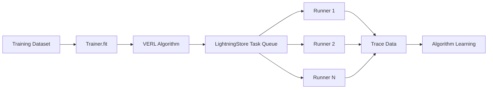
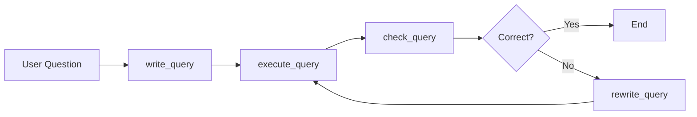

# In-Depth Guide to Training and GRPO Algorithm

This document provides a comprehensive analysis of how Agent-Lightning handles training datasets, agent training, and the GRPO reinforcement learning algorithm, with particular focus on SQL-type tasks and open-ended answer scenarios.

!!! info "Chinese Version Available"
    A Chinese version of this document is available at [Training & GRPO (中文)](training-and-grpo-cn.md).

## Table of Contents

1. [Overview](#overview)
2. [Training Dataset Management](#training-dataset-management)
3. [Agent Training Architecture](#agent-training-architecture)
4. [Reinforcement Learning Application](#reinforcement-learning-application)
5. [GRPO Algorithm Deep Dive](#grpo-algorithm-deep-dive)
6. [Reward Function Design](#reward-function-design)
7. [SQL Task Training Practice](#sql-task-training-practice)
8. [Open-Ended Answer Scenarios](#open-ended-answer-scenarios)
9. [Training Highlights Summary](#training-highlights-summary)

---

## Overview

Agent-Lightning is a flexible AI agent training framework with the following core features:

- **Zero Code Change**: Train existing agents with minimal modifications
- **Framework Agnostic**: Works with LangChain, AutoGen, CrewAI, LangGraph, and more
- **Algorithm Diversity**: Supports RL, APO, SFT, and other training algorithms
- **Selective Optimization**: Choose which agents to optimize in multi-agent systems

---

## Training Dataset Management

### Dataset Formats

Agent-Lightning supports multiple dataset formats:

1. **Parquet Format** (Recommended for large-scale training):
   ```python
   import pandas as pd
   
   # Load training data
   train_data = pd.read_parquet("data/train.parquet").to_dict(orient="records")
   val_data = pd.read_parquet("data/val.parquet").to_dict(orient="records")
   ```

2. **Dictionary List Format**:
   ```python
   train_dataset = [
       {"question": "Question 1", "context": "Context 1", "answer": "Answer 1"},
       {"question": "Question 2", "context": "Context 2", "answer": "Answer 2"},
       # ...
   ]
   ```

3. **Custom Datasets**: Implement the `Dataset` protocol

### Dataset Configuration

VERL configuration for datasets:

```python
config = {
    "data": {
        "train_batch_size": 32,          # Training batch size
        "max_prompt_length": 4096,       # Maximum prompt length
        "max_response_length": 2048,     # Maximum response length
        "truncation": "error",           # Truncation strategy
    }
}
```

### Data Flow



---

## Agent Training Architecture

### Core Components

The training architecture consists of:

1. **LitAgent**: Agent wrapper class
   ```python
   class MyAgent(agl.LitAgent[TaskType]):
       def rollout(
           self,
           task: TaskType,
           resources: agl.NamedResources,
           rollout: agl.Rollout,
       ) -> float | None:
           # Agent execution logic
           # ...
           return reward  # Return reward value
   ```

2. **LightningStore**: Central data storage
   - Manages task queues
   - Stores trace data
   - Manages resources (e.g., LLM endpoints)

3. **Trainer**: Training coordinator
   - Launches algorithms and runners
   - Manages training loop
   - Coordinates resource allocation

4. **Algorithm**: Training algorithms
   - VERL (Reinforcement Learning)
   - APO (Automatic Prompt Optimization)
   - Baseline (Baseline algorithm)

5. **Runner**: Execution units
   - Fetches tasks from queue
   - Executes agent rollouts
   - Collects trace data

### Training Workflow

```python
# 1. Define agent
agent = MyAgent()

# 2. Configure algorithm
algorithm = agl.VERL(verl_config)

# 3. Create trainer
trainer = agl.Trainer(
    n_runners=10,              # Number of parallel runners
    algorithm=algorithm,       # Training algorithm
    adapter={"agent_match": "my_agent"}  # Agent filter
)

# 4. Start training
trainer.fit(
    agent,
    train_dataset=train_data,
    val_dataset=val_data
)
```

---

## Reinforcement Learning Application

### RL in Agent-Lightning

Agent-Lightning uses reinforcement learning to optimize agent behavior, primarily through the **VERL (Volcano Engine Reinforcement Learning)** framework.

### Why Reinforcement Learning?

1. **Sparse Reward Scenarios**: Many agent tasks can only be evaluated after completion
2. **Exploration-Exploitation Balance**: RL balances exploring new strategies with exploiting known ones
3. **End-to-End Optimization**: Directly optimizes the final task objective without intermediate annotations
4. **High Adaptability**: RL adapts to different types of tasks and reward functions

### Key RL Concepts

- **Rollout**: A complete execution of the agent on a task
- **Trajectory**: The state-action sequence produced during a rollout
- **Reward**: Score for agent behavior
- **Policy**: Agent's decision-making strategy (typically an LLM)
- **Advantage**: Estimated advantage relative to baseline

---

## GRPO Algorithm Deep Dive

### GRPO Introduction

**GRPO (Group Relative Policy Optimization)** is one of the main RL algorithms used in Agent-Lightning, particularly well-suited for agent training scenarios.

### How GRPO Works

1. **Group Sampling**:
   - Generate multiple rollouts for the same task (e.g., `n=4`)
   - These rollouts form a group

2. **Relative Advantage Estimation**:
   - Calculate relative advantage for each rollout within the group
   - Use within-group normalization to estimate advantages

   ```python
   # Pseudocode
   rewards = [r1, r2, r3, r4]  # Rewards for 4 rollouts in group
   mean_reward = mean(rewards)
   std_reward = std(rewards)
   advantages = [(r - mean_reward) / std_reward for r in rewards]
   ```

3. **Policy Optimization**:
   - Use PPO (Proximal Policy Optimization) to update policy
   - Reinforce high-advantage rollouts, suppress low-advantage ones

### GRPO Configuration

```python
config = {
    "algorithm": {
        "adv_estimator": "grpo",      # Use GRPO
        "use_kl_in_reward": False,    # Whether to use KL divergence in reward
    },
    "actor_rollout_ref": {
        "rollout": {
            "n": 4,                   # Group size: 4 rollouts per task
        },
        "actor": {
            "ppo_mini_batch_size": 32,
            "optim": {"lr": 1e-6},    # Learning rate
            "clip_ratio_low": 0.2,    # PPO clip lower bound
            "clip_ratio_high": 0.3,   # PPO clip upper bound
        }
    }
}
```

### GRPO Advantages

1. **High Sample Efficiency**: Within-group comparison reduces variance
2. **Good Stability**: Relative advantage estimation is more stable than absolute
3. **High Adaptability**: Works with different reward function scales
4. **Parallel-Friendly**: Within-group rollouts can be executed in parallel

### GRPO vs Other RL Algorithms

| Algorithm | Advantage Estimation | Sample Efficiency | Stability | Use Cases |
|-----------|---------------------|-------------------|-----------|-----------|
| GRPO | Within-group relative | High | Good | Agent training |
| PPO | GAE | Medium | Medium | General RL |
| RLOO | Leave-one-out | Medium | Good | Small group sampling |

---

## Reward Function Design

### Role of Reward Functions

Reward functions are the core of RL training, defining "what is good behavior." A good reward function should:

1. **Align with Task Objectives**: Rewards should reflect true task goals
2. **High Discriminative Power**: Distinguish between good and bad performance
3. **Computationally Efficient**: Fast evaluation
4. **Robust**: Insensitive to noise and outliers

### Types of Reward Functions

#### 1. Binary Reward

The simplest reward function with only success (1.0) and failure (0.0):

```python
def binary_reward(prediction: str, ground_truth: str) -> float:
    """Binary reward: 1.0 for exact match, 0.0 otherwise"""
    return 1.0 if prediction == ground_truth else 0.0
```

**Pros**: Simple and clear
**Cons**: Limited information, can't distinguish "close" from "completely wrong"

#### 2. Continuous Reward

Provides fine-grained feedback:

```python
def similarity_reward(prediction: str, ground_truth: str) -> float:
    """Similarity-based continuous reward"""
    from difflib import SequenceMatcher
    similarity = SequenceMatcher(None, prediction, ground_truth).ratio()
    return similarity  # Returns value between 0.0 and 1.0
```

**Pros**: More information, smoother gradients
**Cons**: Requires appropriate similarity metric

#### 3. Multi-dimensional Reward

Considers multiple evaluation metrics:

```python
from agentlightning import emit_reward

# Emit multi-dimensional reward
emit_reward(
    {
        "accuracy": 0.9,        # Accuracy
        "efficiency": 0.7,      # Efficiency
        "completeness": 0.85,   # Completeness
    },
    primary_key="accuracy"      # Primary metric
)
```

**Pros**: Comprehensive evaluation
**Cons**: Need to balance different dimensions

### Reward Function Implementation

#### Method 1: Direct Return

```python
class MyAgent(agl.LitAgent[Dict[str, Any]]):
    def rollout(
        self,
        task: Dict[str, Any],
        resources: agl.NamedResources,
        rollout: agl.Rollout,
    ) -> float:
        # Execute task
        result = self.execute_task(task)
        
        # Calculate reward
        reward = self.evaluate(result, task["expected"])
        
        # Return reward value directly
        return reward
```

#### Method 2: Using emit_reward

```python
from agentlightning import emit_reward

def rollout(...) -> None:
    # Execute task
    result = self.execute_task(task)
    
    # Calculate and emit reward
    reward = self.evaluate(result, task["expected"])
    emit_reward(reward)
    
    # Return None
    return None
```

**Note**: Don't use both methods simultaneously - it will cause duplicate reward signals!

### Intermediate Rewards

For multi-step tasks, emit rewards at intermediate steps:

```python
from agentlightning import emit_reward, operation

def rollout(...) -> float:
    # Step 1: Planning
    with operation("planning"):
        plan = self.create_plan(task)
        plan_reward = evaluate_plan(plan)
        emit_reward(plan_reward)
    
    # Step 2: Execution
    with operation("execution"):
        result = self.execute_plan(plan)
        execution_reward = evaluate_execution(result)
        emit_reward(execution_reward)
    
    # Final reward
    final_reward = evaluate_final(result, task["expected"])
    return final_reward
```

---

## SQL Task Training Practice

### SQL Agent Architecture

The SQL Agent is a classic example in Agent-Lightning, demonstrating how to train a text-to-SQL agent.

#### Workflow



#### Key Components

1. **LangGraph Workflow**: Defines iterative SQL generation process
2. **Prompt Templates**: Guide LLM to generate correct SQL
3. **Executor**: Executes SQL queries on database
4. **Checker**: Validates SQL correctness
5. **Rewriter**: Improves SQL based on feedback

### SQL Training Dataset

#### Spider Dataset

Agent-Lightning uses the [Spider dataset](https://yale-lily.github.io/spider), containing:

- **Training set**: ~8,000 samples
- **Validation set**: ~500 samples
- **Test set**: ~1,000 samples

Each sample contains:
```python
{
    "question": "Find the names of all students who have a GPA greater than 3.5",
    "db_id": "student_db",
    "query": "SELECT name FROM students WHERE gpa > 3.5",
    # ... other metadata
}
```

### SQL Reward Function

The SQL task reward function is based on **execution result matching**:

```python
def evaluate_query(
    generated_query: str,
    ground_truth_query: str,
    database_path: str,
    raise_on_error: bool = False
) -> float:
    """Evaluate generated SQL query
    
    Args:
        generated_query: Agent-generated SQL
        ground_truth_query: Ground truth SQL
        database_path: Database file path
        raise_on_error: Whether to raise exceptions
    
    Returns:
        1.0 if execution results match, 0.0 otherwise
    """
    from spider_eval.exec_eval import eval_exec_match
    
    try:
        # Execute both queries on same database, compare results
        exec_score = eval_exec_match(
            db=database_path,
            p_str=generated_query,    # Predicted query
            g_str=ground_truth_query, # Ground truth query
            plug_value=False,
            keep_distinct=False,
        )
        return 1.0 if exec_score == 1 else 0.0
    except Exception as e:
        if raise_on_error:
            raise
        else:
            logger.exception(f"Error evaluating query: {e}")
            return 0.0
```

#### Why Use Execution Result Matching?

1. **Semantic Equivalence**: Different SQL can produce same results
   ```sql
   -- Two semantically equivalent queries
   SELECT * FROM users WHERE age > 18
   SELECT * FROM users WHERE age >= 19
   ```

2. **Robustness**: Not affected by SQL format differences (spaces, newlines, case)

3. **Accuracy**: Directly measures whether query correctly answers question

### SQL Training Configuration

Complete SQL agent training configuration:

```python
config = {
    "algorithm": {
        "adv_estimator": "grpo",
        "use_kl_in_reward": False,
    },
    "data": {
        "train_batch_size": 32,
        "max_prompt_length": 4096,
        "max_response_length": 2048,
    },
    "actor_rollout_ref": {
        "rollout": {
            "n": 4,                              # GRPO group size
            "multi_turn": {"format": "hermes"},  # Tool call format
            "name": "vllm",
            "engine_kwargs": {
                "vllm": {
                    "enable_auto_tool_choice": True,
                    "tool_call_parser": "hermes",
                }
            },
        },
        "actor": {
            "ppo_mini_batch_size": 32,
            "optim": {"lr": 1e-6},
        },
        "model": {
            "path": "Qwen/Qwen2.5-Coder-1.5B-Instruct",
        },
    },
    "trainer": {
        "n_gpus_per_node": 1,
        "total_epochs": 2,
        "test_freq": 32,              # Validate every 32 steps
        "save_freq": 64,              # Save checkpoint every 64 steps
    }
}
```

### Selective Training

SQL Agent contains multiple sub-agents (write_query, check_query, rewrite_query). You can selectively train:

```python
# Only train write_query and rewrite_query
trainer = agl.Trainer(
    n_runners=10,
    algorithm=algorithm,
    adapter={"agent_match": "write"}  # Match agents containing "write"
)

# Train all agents
trainer = agl.Trainer(
    n_runners=10,
    algorithm=algorithm,
    adapter={"agent_match": None}  # No filtering
)
```

### SQL Training Results

Training Qwen-2.5-Coder-1.5B-Instruct on Spider dataset:

- **Initial Accuracy**: ~46%
- **Post-Training Accuracy**: ~74% (validation set)
- **Training Time**: ~12 hours (single 80GB GPU)
- **Improvement**: +28 percentage points

---

## Open-Ended Answer Scenarios

!!! note "About the Strategies in This Section"
    This section presents multiple reward function design strategies that can be used for open-ended answer scenarios. **Important notes**:
    
    - **GRPO training examples in the project** (SQL, Calc-X, RAG) all use **deterministic evaluation** methods (execution result matching, mathematical equivalence checking, F1 scores, etc.) that compute rewards in real-time during training.
    - **LLM-as-a-Judge** strategy has actual implementation in the project's **APO (Automatic Prompt Optimization) example** (`examples/apo/apo_custom_algorithm.py`), where it evaluates prompt quality during training.
    - Other strategies in this section (embedding similarity, multi-metric combinations, human feedback, etc.) are **recommended design approaches** that can be flexibly adopted based on specific task requirements.

### Challenges with Open-Ended Answers

Open-ended answer scenarios (Q&A, summarization, creative writing) are harder to evaluate than closed-form tasks (SQL, code generation):

1. **Answer Diversity**: Multiple correct answers may exist
2. **Subjectivity**: No clear right/wrong standard
3. **Partial Correctness**: Answers may be partially correct
4. **Context Dependence**: Correctness depends on context

### Strategy 1: LLM-as-a-Judge

!!! example "Project Implementation"
    This strategy has actual implementation in `examples/apo/apo_custom_algorithm.py`. The example uses an LLM to evaluate generated text quality **during APO training**. Note this is for APO (prompt optimization), not GRPO training.

Use another LLM to evaluate answer quality:

```python
def llm_judge_reward(
    question: str,
    answer: str,
    reference: str,
    judge_model: str = "gpt-4"
) -> float:
    """Use LLM as judge
    
    Args:
        question: Question
        answer: Agent's answer
        reference: Reference answer (optional)
        judge_model: Judge model
    
    Returns:
        Score between 0.0 and 1.0
    """
    prompt = f"""
    Please evaluate the quality of the following answer (0-10):
    
    Question: {question}
    Reference: {reference}
    Answer to Evaluate: {answer}
    
    Evaluation Criteria:
    - Accuracy (correctly answers question)
    - Completeness (covers all points)
    - Relevance (related to question)
    - Clarity (clearly expressed)
    
    Return only the score (0-10).
    """
    
    # Call judge model
    score = call_llm(judge_model, prompt)
    
    # Normalize to 0.0-1.0
    return float(score) / 10.0
```

**Pros**:
- Handles complex semantic relationships
- Can consider multiple evaluation dimensions
- High flexibility

**Cons**:
- High evaluation cost (requires LLM calls)
- Potential bias
- Slow evaluation

### Strategy 2: Similarity-Based Evaluation

Use embedding models to compute semantic similarity:

```python
def embedding_similarity_reward(
    answer: str,
    reference: str,
    model: str = "text-embedding-ada-002"
) -> float:
    """Embedding similarity-based reward
    
    Args:
        answer: Agent's answer
        reference: Reference answer
        model: Embedding model
    
    Returns:
        Cosine similarity (0.0 to 1.0)
    """
    import numpy as np
    from openai import OpenAI
    
    client = OpenAI()
    
    # Get embeddings
    answer_emb = client.embeddings.create(
        input=answer, model=model
    ).data[0].embedding
    
    reference_emb = client.embeddings.create(
        input=reference, model=model
    ).data[0].embedding
    
    # Compute cosine similarity
    similarity = np.dot(answer_emb, reference_emb) / (
        np.linalg.norm(answer_emb) * np.linalg.norm(reference_emb)
    )
    
    # Normalize to 0.0-1.0 (cosine similarity ranges from -1 to 1)
    return (similarity + 1) / 2
```

**Pros**:
- Fast evaluation
- Low cost
- Batch processing capable

**Cons**:
- Cannot understand complex semantic relationships
- May be sensitive to length
- Cannot handle structured information

### Strategy 3: Multi-Metric Combined Evaluation

Combine multiple metrics for comprehensive evaluation:

```python
from agentlightning import emit_reward

def multi_metric_reward(
    question: str,
    answer: str,
    reference: str,
) -> float:
    """Multi-metric combined evaluation
    
    Returns primary reward while emitting multi-dimensional rewards
    """
    # 1. ROUGE score (word overlap)
    from rouge import Rouge
    rouge = Rouge()
    rouge_scores = rouge.get_scores(answer, reference)[0]
    rouge_l = rouge_scores['rouge-l']['f']
    
    # 2. BLEU score (n-gram matching)
    from nltk.translate.bleu_score import sentence_bleu
    bleu = sentence_bleu([reference.split()], answer.split())
    
    # 3. Embedding similarity
    embedding_sim = embedding_similarity_reward(answer, reference)
    
    # 4. Length penalty (avoid too short or too long answers)
    length_ratio = len(answer) / len(reference)
    length_penalty = 1.0 - abs(1.0 - length_ratio) * 0.5
    length_penalty = max(0.0, min(1.0, length_penalty))
    
    # Emit multi-dimensional reward
    emit_reward(
        {
            "rouge_l": rouge_l,
            "bleu": bleu,
            "embedding_similarity": embedding_sim,
            "length_penalty": length_penalty,
        },
        primary_key="embedding_similarity"
    )
    
    # Return primary reward (e.g., embedding similarity)
    return embedding_sim
```

**Pros**:
- Comprehensive quality evaluation
- Can optimize for different metrics
- Provides detailed feedback

**Cons**:
- Complex implementation
- Need to balance different metrics

### Best Practice Recommendations

For open-ended answer scenarios:

1. **Start with Simple Evaluation**:
   - Begin with simple similarity metrics
   - Iterate quickly to validate training pipeline

2. **Gradually Introduce Complex Evaluation**:
   - After training stabilizes, introduce more complex evaluators
   - Can use LLM-as-a-Judge for finer-grained evaluation

3. **Combine Multiple Metrics**:
   - Don't rely on a single metric
   - Use multi-dimensional rewards for comprehensive feedback

4. **Establish Evaluation Baselines**:
   - Collect human evaluations as benchmarks
   - Validate automatic evaluator effectiveness

5. **Iterate and Improve**:
   - Adjust evaluation strategy based on training results
   - Pay attention to evaluator bias and limitations

### Practical Guide: Implementing Reward Functions for Open-Ended Scenarios in GRPO Training

Here's a complete example showing how to implement reward functions for open-ended Q&A tasks in GRPO training:

```python
import agentlightning as agl
from typing import Dict, Any
import numpy as np
from openai import OpenAI

class OpenEndedQAAgent(agl.LitAgent[Dict[str, Any]]):
    """Open-ended Q&A Agent trained with GRPO"""
    
    def __init__(self):
        super().__init__()
        self.embedding_client = OpenAI()  # For semantic similarity
    
    def rollout(
        self,
        task: Dict[str, Any],
        resources: agl.NamedResources,
        rollout: agl.Rollout,
    ) -> float:
        """Execute one rollout and return reward"""
        
        # 1. Get LLM resource and generate answer
        llm = resources["main_llm"]
        question = task["question"]
        
        # Simplified for demonstration - use your actual agent logic
        # answer = your_agent_logic(question, llm)
        answer = "Agent generated answer..."  # Placeholder
        
        # 2. Calculate reward (using deterministic methods)
        reward = self._compute_reward(
            answer=answer,
            reference=task["reference_answer"],
            question=question
        )
        
        # 3. Return reward to GRPO algorithm
        return reward
    
    def _compute_reward(
        self,
        answer: str,
        reference: str,
        question: str
    ) -> float:
        """
        Calculate reward for open-ended answers
        Recommended to use deterministic methods for fast, stable training
        """
        
        # Method 1: F1 score (recommended for Q&A)
        f1_score = self._compute_f1(answer, reference)
        
        # Method 2: Embedding similarity (recommended for semantic evaluation)
        embedding_similarity = self._compute_embedding_similarity(answer, reference)
        
        # Method 3: Combine multiple metrics
        # Weights can be adjusted based on task
        final_reward = (
            f1_score * 0.4 +
            embedding_similarity * 0.6
        )
        
        return final_reward
    
    def _compute_f1(self, prediction: str, ground_truth: str) -> float:
        """Calculate F1 score (token level)"""
        pred_tokens = set(prediction.lower().split())
        truth_tokens = set(ground_truth.lower().split())
        
        if len(pred_tokens) == 0 or len(truth_tokens) == 0:
            return 0.0
        
        common = pred_tokens & truth_tokens
        if len(common) == 0:
            return 0.0
        
        precision = len(common) / len(pred_tokens)
        recall = len(common) / len(truth_tokens)
        f1 = 2 * precision * recall / (precision + recall)
        
        return f1
    
    def _compute_embedding_similarity(
        self,
        answer: str,
        reference: str
    ) -> float:
        """Calculate semantic similarity (using embedding model)"""
        try:
            # Get embeddings
            answer_emb = self.embedding_client.embeddings.create(
                input=answer,
                model="text-embedding-ada-002"
            ).data[0].embedding
            
            reference_emb = self.embedding_client.embeddings.create(
                input=reference,
                model="text-embedding-ada-002"
            ).data[0].embedding
            
            # Calculate cosine similarity
            similarity = np.dot(answer_emb, reference_emb) / (
                np.linalg.norm(answer_emb) * np.linalg.norm(reference_emb)
            )
            
            # Normalize to 0-1
            return (similarity + 1) / 2
        except Exception as e:
            # Fallback to F1 if embedding API fails
            return self._compute_f1(answer, reference)

# Configure GRPO training
config = {
    "algorithm": {
        "adv_estimator": "grpo",
        "use_kl_in_reward": False,
    },
    "actor_rollout_ref": {
        "rollout": {
            "n": 4,  # GRPO group size
        },
        # ... other configs
    }
}

# Start training
agent = OpenEndedQAAgent()
algorithm = agl.VERL(config)
trainer = agl.Trainer(n_runners=10, algorithm=algorithm)
trainer.fit(agent, train_dataset=train_data, val_dataset=val_data)
```

**Key Points**:

1. **Avoid Using LLM-as-a-Judge in GRPO Training**:
   - LLM calls are expensive and slow
   - May introduce instability and bias
   - Recommended for APO or post-training evaluation

2. **Recommended Deterministic Evaluation Methods**:
   - **F1 Score**: Suitable for Q&A, text matching tasks
   - **Embedding Similarity**: Suitable for semantic evaluation, relatively fast
   - **ROUGE/BLEU**: Suitable for summarization, translation tasks
   - **Combined Metrics**: Combine multiple metrics for comprehensive evaluation

3. **Performance Considerations**:
   - Embedding API calls can be batched for speed
   - Cache embeddings for frequently used reference answers
   - For large-scale training, consider local embedding model deployment

4. **If You Really Need LLM-as-a-Judge**:
   - Consider filtering with deterministic methods first, then using LLM to evaluate top N% samples
   - Or train a small discriminator model to replace LLM
   - Or use in APO phase rather than GRPO phase

---

## Training Highlights Summary

### 1. Zero Code Change Training

Agent-Lightning's biggest highlight is minimal code modification:

```python
# Original agent code
def my_agent(task):
    result = process(task)
    return result

# Trainable agent
class MyAgent(agl.LitAgent):
    def rollout(self, task, resources, rollout):
        result = process(task)
        reward = evaluate(result, task["expected"])
        return reward  # Just add this line!
```

### 2. Framework Agnostic

Supports multiple agent frameworks:

- **LangChain/LangGraph**: Like SQL Agent example
- **OpenAI Agent SDK**: Native support
- **AutoGen**: Through adapters
- **Custom Python**: Any Python code works

### 3. Flexible Reward System

- **Simple scenarios**: Direct float return
- **Complex scenarios**: Use `emit_reward` for multi-dimensional rewards
- **Intermediate rewards**: Support emitting rewards during execution

### 4. Efficient GRPO Algorithm

- **Within-group comparison**: Reduces variance, improves sample efficiency
- **Parallel-friendly**: Within-group rollouts can be parallel
- **Stable training**: Relative advantage estimation more stable

### 5. Selective Optimization

In multi-agent systems, selectively optimize specific agents:

```python
# Only optimize agents containing "write"
trainer = agl.Trainer(
    adapter={"agent_match": "write"}
)
```

### 6. Comprehensive Tracing System

- **Automatic tracing**: Automatically collects all LLM calls
- **OpenTelemetry**: Based on standard distributed tracing
- **LangChain integration**: Native LangChain tracing support

### 7. Distributed Training Support

- **Multiple runners in parallel**: Support concurrent runner execution
- **Ray integration**: Ray-based distributed execution
- **Multi-GPU support**: Support multi-GPU training

### 8. Flexible Deployment Modes

```python
# Development mode: Quick validation
trainer.dev(agent, dev_dataset=small_dataset)

# Training mode: Full training
trainer.fit(agent, train_dataset=full_dataset)
```

---

## Summary

Agent-Lightning provides a complete agent training solution:

1. **Training Dataset Management**: Supports various data formats with flexible configuration
2. **Agent Training Architecture**: Clear component layering, easy to extend
3. **Reinforcement Learning Application**: Efficient GRPO-based RL training
4. **Reward Function Design**: Multiple strategies from simple to complex
5. **SQL Task Practice**: Complete end-to-end training example
6. **Open-Ended Answer Handling**: Multiple evaluation strategies for complex scenarios

Whether for closed-form tasks (SQL, code generation) or open-ended tasks (Q&A, summarization), Agent-Lightning provides flexible and efficient training solutions.

---

## References

- [Agent-Lightning Official Documentation](https://microsoft.github.io/agent-lightning/)
- [GRPO Paper](https://arxiv.org/abs/2508.03680)
- [VERL Framework](https://github.com/volcengine/verl)
- [Spider Dataset](https://yale-lily.github.io/spider)
- [Train SQL Agent Tutorial](https://microsoft.github.io/agent-lightning/stable/how-to/train-sql-agent/)
